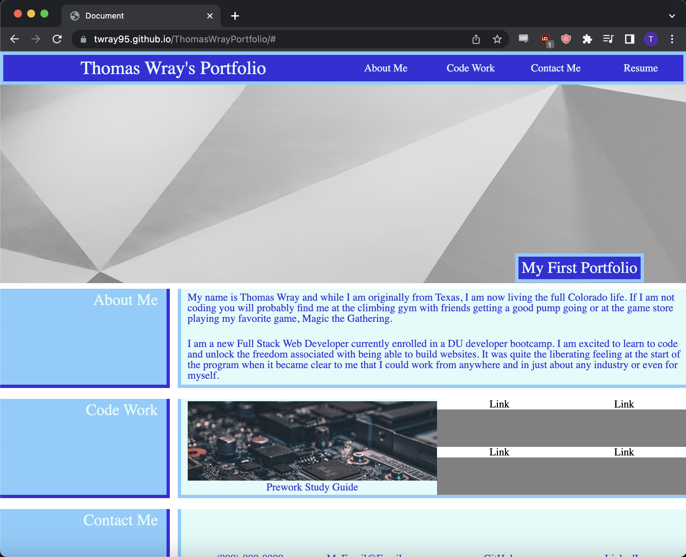

# <Thomas Wray Portfolio>

## Description

This homepage was made to advertise Thomas Wray's code work to potential employers. I built this website so that I could have effective communication of my coding abilities to potential employers. The website allows the user to jump to different sections of the webpage from the header to access more specific information on myself, code work, and contacting me.

## Screenshot

## Usage

There are two interactable elements in the webpage. The first is within the header where users can click the "About Me", "Code Work", and "Contact Me" elements and the page will jump down to the relevant sections in the main section.

The second interactable element is the Prework Study Guide link within the Code Work article. The link will open a new tab to the deployment of my prework study guide webpage.

## Link to Deployment

[Thomas Wray Portfolio](https://twray95.github.io/ThomasWrayPortfolio/)

## Credits

Image assets were aquired from unsplash at the follow links.
https://unsplash.com/photos/FO7JIlwjOtU
https://unsplash.com/photos/_JBKdviweXI

## License

I used the MIT License for this project, please refrese the LICENSE for more information.
